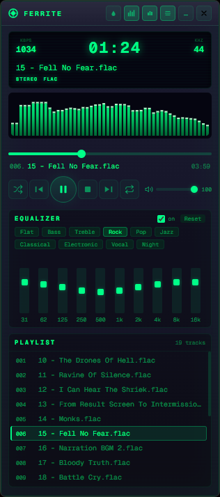

# Ferrite

A Winamp-style desktop audio player. Lightweight, no heavy rendering engine — Tauri + Rust + vanilla JS.



---

## Features

**Playback**
- MP3, FLAC, WAV, OGG, Opus, M4A / AAC, WMA, AIFF
- Controls: play / pause / stop / seek / volume
- Modes: sequential, shuffle, repeat track, repeat playlist

**Playlist**
- Drag and drop files from the file manager
- Reorder tracks by dragging within the list
- Remove tracks with the Delete key

**Equalizer**
- 10 bands: 31 Hz — 16 kHz
- Range: ±12 dB per band
- 10 presets: Flat, Bass, Treble, Rock, Pop, Jazz, Classical, Electronic, Vocal, Night

**Spectrum**
- 48-band real-time analyzer (FFT 2048)
- Peak hold, idle animation in silence

**LCD display**
- Track position / duration
- Bitrate (kbps), sample rate (kHz), Stereo / Mono, format

**Window**
- Frameless with a custom title bar
- Collapsible panels: equalizer, spectrum, playlist
- Snap to screen edges
- Position and size saved between sessions

---

## Build

**Requirements:**
- [Rust](https://rustup.rs) ≥ 1.85 (edition 2024)
- [Tauri CLI v2](https://tauri.app/start/prerequisites/)
- Node.js (only needed to run the Tauri CLI)

```bash
# Clone the repository
git clone <url>
cd ferrite2

# Run in development mode
cargo tauri dev

# Release build
cargo tauri build
```

The installer will be in `src-tauri/target/release/bundle/`.

Config path:
- **Windows:** `%APPDATA%\com.ferrite.app\`
- **macOS:** `~/Library/Application Support/com.ferrite.app/`
- **Linux:** `~/.config/com.ferrite.app/`

---

## License

MIT or Apache 2.0 — your choice. See [LICENSE-MIT](LICENSE-MIT), [LICENSE-APACHE](LICENSE-APACHE).
